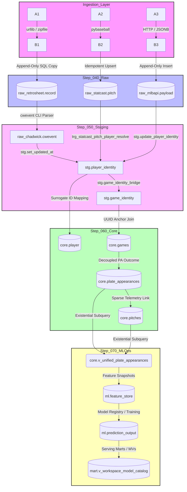

# Sabermetric Database Architecture, System Validation, and Enterprise Ingestion Engineering for the Major League Baseball Analytics Platform

## Multi-Layered Database Architecture and Validation

The architectural paradigm of the Major League Baseball (MLB) analytics platform centers on a PostgreSQL-first database engine that functions as an active, durable operational control plane rather than a passive storage layer. To support multi-era datasets spanning from the inception of professional baseball in 1871 to high-frequency modern telemetry, the schema is organized into a highly disciplined, multi-stage Directed Acyclic Graph (DAG). This pipeline progressively cleans, normalizes, and contextualizes raw data, isolating fragile source assumptions from downstream predictive models and serving interfaces.

The system's execution order is strictly governed by a nine-step directory prefix sequence. This physical layering ensures that PostgreSQL extensions, schemas, meta-tables, raw tables, staging structures, canonical core tables, and machine learning operations are compiled in a reproducible and idempotent manner.



The database pipeline progresses through distinct, non-overlapping schema boundaries to maintain forensic traceability and performance optimization. The operational roles of each layer are detailed in the following schema registry:

| Pipeline Step | Schema Name | Logical Responsibility | Storage and Mutability Contracts |
|---|---|---|---|
| Step 010 | `public` / Ext | System-level PostgreSQL extension compilation. | Mutable; compiles pgcrypto, citext, and btree_gist. |
| Step 020 | `auth` | Multi-tenant workspace security, roles, and RLS policies. | Mutable; houses tenant metadata and active API keys. |
| Step 030 | `meta` | Ingestion control plane, source registry, and audit logging. | Append-only transaction and run-execution state tracking. |
| Step 040 | `raw_*` | Forensic source landing; strict source-faithful schemas. | Strict append-only; zero transformations or modifications allowed. |
| Step 050 | `stg` | Identity bridging, cross-source mapping, and conformance. | Mutable; matches natural keys to candidate identities. |
| Step 060 | `core` | Canonical warehouse; decoupled gameplay and entity tables. | Strictly conformed, surrogate-keyed historical database. |
| Step 070 | `ml` / `ops` | Feature store, model registry, live pollers, and scheduling. | Mixed; mutable operational states and immutable evaluation logs. |
| Step 080 | `util` / Func | Stored procedures, triggers, and programmatic SQL helpers. | Immutable function definitions; executable across schemas. |
| Step 090 | constraints | Performance tuning, indexes, and primary/foreign keys. | Compiled after bulk loading to eliminate write bottlenecks. |

***

## Comprehensive Database Component Auditing and Validation

Maintaining strict structural and behavioral constraints across multiple schemas requires a highly disciplined auditing strategy. Each layer utilizes specific database elements — such as unique partial indexes, transactional boundaries, and non-blocking database triggers — to ensure performance and logical consistency.

### Primary and Foreign Key Constraints

Primary and foreign keys are explicitly separated from table creation DDL. They are applied during Step 090 to eliminate index-rebuilding overhead during high-volume historical loads.

Primary keys in the raw schema (`raw_*`) are composite keys tied to source-specific natural identifiers (such as `(event_file_id, game_id, record_sequence)` in the Retrosheet raw tables) to guarantee physical row uniqueness.

In contrast, the core canonical layer (`core`) uses auto-generated, surrogate UUID and BIGSERIAL keys. This design isolates internal database links from changes in external naming conventions or source formatting shifts.

All foreign keys use the `ON UPDATE RESTRICT` and `ON DELETE RESTRICT` or `ON DELETE CASCADE` modifiers. This prevents dangling relational pointers when staging tables are modified.

### Indexing Strategies and Unique Partial Constraints

Due to the wide-table design of sabermetric datasets, database queries can trigger expensive sequential scans. To prevent this, indexes are strategically placed on foreign keys and commonly joined columns, such as `core.plate_appearances(game_id, batter_id, pitcher_id)`.

A key index design feature is the use of unique partial indexes on the player identity bridge table, `stg.player_identity`. This enforces uniqueness across external IDs while permitting standard NULL values for older historical players:

```sql
CREATE UNIQUE INDEX IF NOT EXISTS stg_player_identity_retrosheet_uidx
    ON stg.player_identity (retrosheet_player_id)
    WHERE retrosheet_player_id IS NOT NULL;
```

This partial index design prevents duplicate bridge rows across sources while maintaining fast, index-driven lookups for active players.

### Database Trigger Architecture

Triggers are used to automate data synchronization, maintain audits, and prevent orphaned records. Two critical trigger patterns are deployed:

**Staging Timestamp Management:** Any table in the `stg`, `core`, or `ml_ops` layers with an `updated_at` column is bound to the `trg_..._updated_at` trigger. This trigger automatically updates the column via `stg.set_updated_at()` before any write:

```sql
CREATE OR REPLACE FUNCTION stg.set_updated_at()
RETURNS TRIGGER AS $$
BEGIN
    NEW.updated_at = NOW();
    RETURN NEW;
END;
$$ LANGUAGE plpgsql;
```

**Statcast Auto-Resolution Bridge:** When a raw pitch record is inserted into `raw_statcast.pitch`, the trigger `trg_statcast_pitch_player_resolve` calls `stg.fn_auto_resolve_statcast_player()`. This function inserts a placeholder record with an initial `identity_confidence_score = 0.0` and `identity_source = 'auto:statcast'` for any new MLBAM ID. This non-blocking write ensures the database never rejects a raw insert due to identity resolution latency.

***

## Decoupled Gameplay Schema Validation

The conformed gameplay layer was refactored in May 2026 to resolve structural friction when joining physical tracking telemetry with historical game logs. The original schema combined pitch-level tracking with overall plate appearance outcomes. This created a sparse, heavily duplicated table when ingesting historical sources that lack pitch-by-pitch tracking.

The refactored schema decouples At-Bat / Plate Appearance outcomes from Pitch Telemetry:

- **`core.games`** — The conformed game dimension, mapping unique matches to a stable `canonical_game_id` UUID.
- **`core.plate_appearances`** — Represents individual plate appearances, tracking the batter, pitcher, inning, and overall event outcome. This table is conformed across all eras, supporting both historical Retrosheet play-by-play and modern MLB Stats API data.
- **`core.pitches`** — Stores granular physical pitch telemetry. This table is highly populated for modern seasons but remains sparse or empty for older historical games, maintaining data integrity across eras.

The relationship between these entities is managed by the unified view `core.v_unified_plate_appearances`. This view uses an existential subquery to expose whether a play contains physical pitch telemetry:

```sql
CREATE OR REPLACE VIEW core.v_unified_plate_appearances AS
SELECT
    pa.plate_appearance_id,
    pa.game_id,
    g.game_date,
    g.season,
    pa.batter_id,
    pa.pitcher_id,
    pa.inning,
    pa.half_inning,
    pa.event_result_code,
    pa.data_source_lineage,
    CASE
        WHEN EXISTS (
            SELECT 1 FROM core.pitches p
            WHERE p.plate_appearance_id = pa.plate_appearance_id
        ) THEN TRUE
        ELSE FALSE
    END AS has_pitch_telemetry
FROM core.plate_appearances pa
JOIN core.games g ON pa.game_id = g.game_id;
```

This decoupled schema supports spatial and physics queries on modern datasets without degrading performance on historical, game-level analytics.

***

## Database Bootstrapping and Asynchronous Migration Engine

To construct the platform, the database must be initialized from scratch. The initialization process applies the sequential SQL schemas in their correct lexicographical folder order, starting with extensions and schemas, progressing to core gameplay, and finishing with constraints and indexes.

The standard initialization shell script `scripts/bootstrap_db.sh` runs sequential `psql` execution paths:

```bash
#!/usr/bin/env bash
set -euo pipefail

DB_NAME="${1:-mlb}"
PSQL="${PSQL:-psql}"
CREATEDB_BIN="${CREATEDB_BIN:-createdb}"
DROPDB_BIN="${DROPDB_BIN:-dropdb}"
RECREATE_DB="${RECREATE_DB:-0}"
SQL_DIR="sql"

if [ ! -d "$SQL_DIR" ]; then
    echo "Expected to run from repository root containing ./sql" >&2
    exit 1
fi

if [ "$RECREATE_DB" = "1" ]; then
    "$DROPDB_BIN" --if-exists "$DB_NAME"
fi

if ! "$PSQL" -d postgres -Atqc "SELECT 1 FROM pg_database WHERE datname = '$DB_NAME'" | grep -q 1; then
    "$CREATEDB_BIN" "$DB_NAME"
fi

run_file() {
    local file="$1"
    echo "==> Applying $file"
    "$PSQL" -v ON_ERROR_STOP=1 -d "$DB_NAME" -f "$file"
}

while IFS= read -r file; do
    run_file "$file"
done < <(find "$SQL_DIR" -type f -name '*.sql' | sort)

echo "Bootstrap complete for database: $DB_NAME"
```

To support local and production deployments, the initialization process can also run asynchronously, leveraging `asyncpg` and Python's `asyncio` loop. The Python bootstrapping utility is written within the `baseball.db` namespace.

In accordance with architectural standards, the script wraps each SQL file in an explicit transaction block (`BEGIN; ... COMMIT;`), reverting any partial changes if compilation fails.

```python
"""
baseball/db/bootstrap.py

Asynchronous database bootstrapping engine. Discovers, orders, and runs
all SQL scripts (Step 010 through 090) within atomic transaction blocks
against the configured DATABASE_URL.
"""

from __future__ import annotations

import asyncio
import logging
import re
from pathlib import Path
from typing import List

import asyncpg
from baseball.settings import get_settings

log = logging.getLogger("baseball.db.bootstrap")


class DatabaseBootstrapper:
    """Orchestrates database migrations and schemas in strict sequence."""

    def __init__(self, sql_root_path: Path) -> None:
        self.sql_root = sql_root_path
        self.settings = get_settings()

    def discover_sql_files(self) -> List[Path]:
        """Discovers and lexicographically sorts all migration SQL scripts."""
        if not self.sql_root.exists():
            raise FileNotFoundError(f"SQL root directory not found at: {self.sql_root}")

        sql_pattern = re.compile(r"^\d+_[a-zA-Z0-9_-]+\.sql$")
        discovered: List[Path] = []

        folders = [
            "010_extensions",
            "020_schemas",
            "030_meta",
            "040_raw",
            "050_staging",
            "060_core",
            "070_ml_ops",
            "080_functions",
            "090_constraints_indexes",
        ]

        for folder in folders:
            folder_path = self.sql_root / folder
            if not folder_path.exists():
                log.warning("Expected migration directory %s does not exist", folder)
                continue
            sorted_files = sorted(
                [f for f in folder_path.glob("*.sql") if sql_pattern.match(f.name)]
            )
            discovered.extend(sorted_files)

        return discovered

    async def execute_script(self, conn: asyncpg.Connection, filepath: Path) -> None:
        """Executes a single SQL script within an isolated transaction block."""
        log.info("Applying migration script: %s/%s", filepath.parent.name, filepath.name)

        with open(filepath, "r", encoding="utf-8") as file:
            sql_content = file.read()

        cleaned_sql = sql_content.strip()
        starts_with_begin = cleaned_sql.upper().startswith("BEGIN;")
        ends_with_commit = cleaned_sql.upper().endswith("COMMIT;")

        async with conn.transaction():
            if not starts_with_begin or not ends_with_commit:
                log.debug("Adding transaction wrapper around SQL script: %s", filepath.name)
                await conn.execute(f"BEGIN;\n{sql_content}\nCOMMIT;")
            else:
                await conn.execute(sql_content)

    async def bootstrap(self, dry_run: bool = False) -> List[str]:
        """Initializes database schemas, tables, functions, and indexes in order."""
        sql_files = self.discover_sql_files()
        executed_files: List[str] = []

        if not sql_files:
            log.warning("No valid migration SQL files discovered.")
            return executed_files

        if dry_run:
            log.info(" Discovered migrations in order:")
            for file in sql_files:
                log.info("  -> %s/%s", file.parent.name, file.name)
            return [str(f.relative_to(self.sql_root)) for f in sql_files]

        dsn = str(self.settings.database.url)
        conn = await asyncpg.connect(dsn)
        try:
            for file in sql_files:
                await self.execute_script(conn, file)
                executed_files.append(str(file.relative_to(self.sql_root)))
            log.info(
                "Database bootstrap completed successfully. %d scripts applied.",
                len(executed_files)
            )
        except Exception as err:
            log.error(
                "Database bootstrapping failed during execution of %s",
                file.name,
                exc_info=True
            )
            raise err
        finally:
            await conn.close()

        return executed_files
```

***

## Enterprise Ingestion Framework and CLI Automation

Following a successful database bootstrap, the platform implements a robust ingestion pipeline wrapped under the `baseball` namespace. This pipeline automates historical downloads and loads data from multiple sources.

The pipeline utilizes the `pybaseball` library for Statcast pitch telemetry. It fetches, parses, and loads historical Retrosheet `.zip` files and compiles them into structured tabular schemas using the Chadwick `cwevent` command-line utility.

The ingestion pipeline is designed with defensive data practices:

- **Strict Data Validation** — The ingestion runner maps raw CSV or API payloads directly to strongly-typed Pydantic schemas before executing inserts.
- **Idempotent Loading Patterns** — To prevent duplicated data on repeated execution, the database inserts use `INSERT ... ON CONFLICT DO UPDATE` or `ON CONFLICT DO NOTHING` statements.
- **Auditable Pipeline Tracing** — Every ingestion execution registers a tracking entry in `meta.ingest_run`, locking the session parameters and logging record counts and processing metrics.

```python
"""
baseball/ingestion/orchestration.py

Idempotent ingestion pipeline and CLI commands for Statcast and Retrosheet.
Implements metadata logging, Pydantic validation, and batch loading.
"""

from __future__ import annotations

import io
import os
import shutil
import zipfile
import tempfile
import logging
import urllib.request
from datetime import date, datetime
from pathlib import Path
from typing import Any, Dict, List, Optional

import pandas as pd
import pydantic
import pybaseball
import typer
from baseball.settings import get_settings

# Database interaction
import psycopg2
import psycopg2.extras

log = logging.getLogger("baseball.ingestion.orchestration")
cli_app = typer.Typer(help="Historical Data Ingestion Pipeline CLI")


# ---------------------------------------------------------------------------
# Pydantic Schemas for Strict Data Validation
# ---------------------------------------------------------------------------

class StatcastPitchSchema(pydantic.BaseModel):
    """Validates raw Statcast pitch rows before inserting into PostgreSQL."""
    pitch_type: Optional[str] = None
    game_date: date
    game_year: int
    game_pk: int
    game_id: Optional[str] = None
    at_bat_number: int
    pitch_number: int
    player_name: Optional[str] = None
    batter: int
    pitcher: int
    events: Optional[str] = None
    description: Optional[str] = None
    balls: int
    strikes: int
    outs_when_up: int
    inning: int
    inning_topbot: str
    home_score: int
    away_score: int
    release_speed: Optional[float] = None
    release_spin_rate: Optional[float] = None
    plate_x: Optional[float] = None
    plate_z: Optional[float] = None

    @pydantic.field_validator("game_date", mode="before")
    @classmethod
    def parse_game_date(cls, val: Any) -> date:
        if isinstance(val, str):
            return datetime.strptime(val, "%Y-%m-%d").date()
        return val


# ---------------------------------------------------------------------------
# Base Ingestion Controller
# ---------------------------------------------------------------------------

class BaseIngester:
    """Manages the metadata logging and lifecycle of an ingestion run."""

    def __init__(self, source_code: str, endpoint_code: str) -> None:
        self.settings = get_settings()
        self.source_code = source_code
        self.endpoint_code = endpoint_code
        self.conn = self._get_connection()

    def _get_connection(self):
        """Creates a synchronous connection to the database."""
        dsn = os.environ.get("DATABASE_URL") or str(self.settings.database.url)
        if "postgresql+asyncpg" in dsn:
            dsn = dsn.replace("postgresql+asyncpg", "postgresql")
        return psycopg2.connect(dsn)

    def start_ingest_run(self, params: Dict[str, Any]) -> str:
        """Creates a transaction record in meta.ingest_run."""
        sql = """
            INSERT INTO meta.ingest_run (
                source_system_id, source_endpoint_id,
                run_status, request_params, started_at
            )
            SELECT
                ss.source_system_id,
                se.source_endpoint_id,
                'running',
                %s::jsonb,
                NOW()
            FROM meta.source_system ss
            JOIN meta.source_endpoint se
                ON se.source_system_id = ss.source_system_id
            WHERE ss.source_code = %s
              AND se.endpoint_code = %s
            RETURNING ingest_run_id;
        """
        with self.conn.cursor() as cur:
            cur.execute(sql, (psycopg2.extras.Json(params), self.source_code, self.endpoint_code))
            run_id = cur.fetchone()
        self.conn.commit()
        return str(run_id)

    def finish_ingest_run(
        self,
        run_id: str,
        status: str,
        seen: int,
        inserted: int,
        updated: int,
        err_msg: Optional[str] = None
    ) -> None:
        """Marks the meta.ingest_run record as finished."""
        sql = """
            UPDATE meta.ingest_run
            SET
                run_status    = %s,
                finished_at   = NOW(),
                records_seen  = %s,
                records_inserted = %s,
                records_updated  = %s,
                error_message = %s
            WHERE ingest_run_id = %s;
        """
        with self.conn.cursor() as cur:
            cur.execute(sql, (status, seen, inserted, updated, err_msg, run_id))
        self.conn.commit()

    def close(self) -> None:
        if self.conn:
            self.conn.close()


# ---------------------------------------------------------------------------
# Statcast Ingestion Engine
# ---------------------------------------------------------------------------

class StatcastIngester(BaseIngester):
    """Downloads pitch telemetry via pybaseball and upserts into database."""

    def __init__(self) -> None:
        super().__init__("statcast", "search_csv")

    def download_and_load(self, start_date: str, end_date: str) -> Dict[str, int]:
        """Pulls and ingests Statcast data for the specified date range."""
        params = {"start_date": start_date, "end_date": end_date}
        run_id = self.start_ingest_run(params)
        log.info("Starting Statcast ingestion run [%s]: %s to %s", run_id, start_date, end_date)

        try:
            df = pybaseball.statcast(start_dt=start_date, end_dt=end_date, verbose=False)
            if df.empty:
                log.warning("No Statcast records found for the range %s to %s", start_date, end_date)
                self.finish_ingest_run(run_id, "succeeded", 0, 0, 0)
                return {"seen": 0, "inserted": 0}

            df["game_year"] = pd.to_datetime(df["game_date"]).dt.year
            df = df.where(pd.notnull(df), None)

            with self.conn.cursor() as cur:
                cur.execute(
                    "INSERT INTO raw_statcast.search_file (query_start_date, query_end_date) "
                    "VALUES (%s, %s) RETURNING statcast_search_file_id;",
                    (start_date, end_date)
                )
                search_file_id = cur.fetchone()

            records_seen = len(df)
            inserted = 0

            with self.conn.cursor() as cur:
                for _, row in df.iterrows():
                    try:
                        validated = StatcastPitchSchema.model_validate({
                            "pitch_type":      row.get("pitch_type"),
                            "game_date":       row.get("game_date"),
                            "game_year":       int(row.get("game_year")),
                            "game_pk":         int(row.get("game_pk")),
                            "at_bat_number":   int(row.get("at_bat_number")),
                            "pitch_number":    int(row.get("pitch_number")),
                            "player_name":     row.get("player_name"),
                            "batter":          int(row.get("batter")),
                            "pitcher":         int(row.get("pitcher")),
                            "events":          row.get("events"),
                            "description":     row.get("description"),
                            "balls":           int(row.get("balls")),
                            "strikes":         int(row.get("strikes")),
                            "outs_when_up":    int(row.get("outs_when_up")),
                            "inning":          int(row.get("inning")),
                            "inning_topbot":   row.get("inning_topbot"),
                            "home_score":      int(row.get("home_score")),
                            "away_score":      int(row.get("away_score")),
                            "release_speed":   row.get("release_speed"),
                            "release_spin_rate": row.get("release_spin_rate"),
                            "plate_x":         row.get("plate_x"),
                            "plate_z":         row.get("plate_z"),
                        })
                        insert_sql = """
                            INSERT INTO raw_statcast.pitch (
                                statcast_search_file_id, pitch_type, game_date, game_year,
                                game_pk, at_bat_number, pitch_number, player_name, batter,
                                pitcher, events, description, balls, strikes, outs_when_up,
                                inning, inning_topbot, home_score, away_score,
                                release_speed, release_spin_rate, plate_x, plate_z
                            ) VALUES (
                                %s, %s, %s, %s, %s, %s, %s, %s, %s, %s, %s, %s,
                                %s, %s, %s, %s, %s, %s, %s, %s, %s, %s, %s
                            )
                            ON CONFLICT (statcast_search_file_id, game_pk, at_bat_number, pitch_number)
                            DO NOTHING;
                        """
                        cur.execute(insert_sql, (
                            search_file_id,
                            validated.pitch_type, validated.game_date, validated.game_year,
                            validated.game_pk, validated.at_bat_number, validated.pitch_number,
                            validated.player_name, validated.batter, validated.pitcher,
                            validated.events, validated.description, validated.balls,
                            validated.strikes, validated.outs_when_up, validated.inning,
                            validated.inning_topbot, validated.home_score, validated.away_score,
                            validated.release_speed, validated.release_spin_rate,
                            validated.plate_x, validated.plate_z
                        ))
                        inserted += cur.rowcount
                    except Exception as parse_error:
                        log.debug("Skipping row due to validation failure: %s", parse_error)
                        continue

            self.conn.commit()
            self.finish_ingest_run(run_id, "succeeded", records_seen, inserted, 0)
            log.info("Completed Statcast ingestion run [%s]. Ingested %d / %d records.", run_id, inserted, records_seen)
            return {"seen": records_seen, "inserted": inserted}

        except Exception as error:
            log.error("Statcast ingestion run [%s] failed: %s", run_id, error, exc_info=True)
            self.finish_ingest_run(run_id, "failed", 0, 0, 0, err_msg=str(error))
            raise error


# ---------------------------------------------------------------------------
# Retrosheet & Chadwick Ingestion Engine
# ---------------------------------------------------------------------------

class RetrosheetIngester(BaseIngester):
    """Downloads historical Retrosheet files, unzips, and parses via Chadwick."""

    def __init__(self, chadwick_bin_dir: Optional[Path] = None) -> None:
        super().__init__("retrosheet", "event_files")
        self.chadwick_dir = chadwick_bin_dir

    def download_and_load_season(self, season: int) -> Dict[str, int]:
        """Orchestrates historical downloads and parses files into PostgreSQL."""
        params = {"season": season}
        run_id = self.start_ingest_run(params)
        log.info("Starting Retrosheet historical ingestion [%s] for season: %d", run_id, season)

        temp_dir = Path(tempfile.mkdtemp(prefix="retrosheet_"))
        try:
            # Step 1: Download season zip archive
            url = f"https://www.retrosheet.org/events/{season}seve.zip"
            zip_path = temp_dir / f"{season}seve.zip"
            log.info("Downloading Retrosheet zip from: %s", url)
            try:
                urllib.request.urlretrieve(url, zip_path)
            except Exception as dl_error:
                log.error("Failed to download Retrosheet zip for season %d: %s", season, dl_error)
                raise dl_error

            # Step 2: Extract play-by-play files
            extracted_files: List[Path] = []
            with zipfile.ZipFile(zip_path, "r") as zip_ref:
                zip_ref.extractall(temp_dir)
                for name in zip_ref.namelist():
                    extracted_path = temp_dir / name
                    if extracted_path.suffix.lower() in [".eva", ".evn", ".evf", ".evr"]:
                        extracted_files.append(extracted_path)
            log.info("Extracted %d play-by-play event files for season %d", len(extracted_files), season)

            with self.conn.cursor() as cur:
                cur.execute(
                    "INSERT INTO meta.source_file (source_system_id, file_name, season) "
                    "VALUES ((SELECT source_system_id FROM meta.source_system WHERE source_code = 'retrosheet'), %s, %s) "
                    "RETURNING source_file_id;",
                    (f"{season}seve.zip", season)
                )
                source_file_id = cur.fetchone()

            total_records_inserted = 0

            # Step 3: Run Chadwick cwevent CLI to parse play-by-play files
            import subprocess
            cwevent_bin = "cwevent"
            if self.chadwick_dir:
                cwevent_bin = str(self.chadwick_dir / "cwevent")
            if not shutil.which(cwevent_bin):
                raise FileNotFoundError(
                    f"Chadwick utility '{cwevent_bin}' was not found. "
                    "Please install Chadwick CLI or verify your path parameters."
                )

            for file_path in extracted_files:
                log.info("Parsing play-by-play file with Chadwick: %s", file_path.name)
                cmd = [cwevent_bin, "-y", str(season), "-f", "0-95", "-n", str(file_path)]
                process = subprocess.run(cmd, capture_output=True, text=True, check=True)

                df = pd.read_csv(io.StringIO(process.stdout))
                df = df.where(pd.notnull(df), None)

                with self.conn.cursor() as cur:
                    cur.execute(
                        """
                        INSERT INTO raw_chadwick.cwevent_file
                            (source_file_id, ingest_run_id, season, field_spec, output_file_name)
                        VALUES (%s, %s, %s, '0-95', %s)
                        RETURNING cwevent_file_id;
                        """,
                        (source_file_id, run_id, season, file_path.name)
                    )
                    cwevent_file_id = cur.fetchone()

                    for _, row in df.iterrows():
                        insert_sql = """
                            INSERT INTO raw_chadwick.cwevent (
                                cwevent_file_id, game_id, away_team_id, inn_ct, bat_home_id,
                                outs_ct, event_id, bat_lineup_id, fld_cd, bat_id, bat_hand_cd,
                                pit_id, pit_hand_cd, pos2_fld_id, pos3_fld_id, pos4_fld_id,
                                pos5_fld_id, pos6_fld_id, pos7_fld_id, pos8_fld_id, pos9_fld_id,
                                res_bat_id, res_bat_hand_cd, res_pit_id, res_pit_hand_cd,
                                first_runner_id, second_runner_id, third_runner_id, event_tx,
                                leadoff_fl, ph_fl, balls_ct, strikes_ct, pitch_seq_tx, event_cd,
                                battedball_cd, bunt_fl, foul_fl, hit_val, sh_fl, sf_fl,
                                hit_location_tx, num_err_ct, wp_fl, pb_fl, ab_fl, h_fl,
                                sh_ball_fl, ibb_fl, gdp_fl, xi_fl, bball_fl, event_runs_ct,
                                bat_dest_id, run1_dest_id, run2_dest_id, run3_dest_id,
                                event_outs_ct, bat_play_tx, run1_play_tx, run2_play_tx,
                                run3_play_tx, sb1_fl, sb2_fl, sb3_fl, cs1_fl, cs2_fl, cs3_fl,
                                po1_fl, po2_fl, po3_fl, resp_fielder1_id, resp_fielder2_id,
                                resp_fielder3_id, resp_fielder_a1_id, resp_fielder_a2_id,
                                resp_fielder_a3_id, resp_fielder_a4_id, resp_fielder_a5_id,
                                resp_fielder_e1_id, resp_fielder_e2_id, resp_fielder_e3_id,
                                resp_fielder_po1_id, resp_fielder_po2_id, resp_fielder_po3_id,
                                away_score_ct, home_score_ct, away_hits_ct, home_hits_ct,
                                away_err_ct, home_err_ct, away_score_fl, home_score_fl,
                                bunt_fc_fl, pa_ball_ct, pa_strike_ct, pa_truncated_fl
                            ) VALUES (
                                %s, %s, %s, %s, %s, %s, %s, %s, %s, %s, %s, %s, %s, %s,
                                %s, %s, %s, %s, %s, %s, %s, %s, %s, %s, %s, %s, %s, %s,
                                %s, %s, %s, %s, %s, %s, %s, %s, %s, %s, %s, %s, %s, %s,
                                %s, %s, %s, %s, %s, %s, %s, %s, %s, %s, %s, %s, %s, %s,
                                %s, %s, %s, %s, %s, %s, %s, %s, %s, %s, %s, %s, %s, %s,
                                %s, %s, %s, %s, %s, %s, %s, %s, %s, %s, %s, %s, %s, %s,
                                %s, %s, %s, %s, %s, %s, %s, %s, %s, %s, %s, %s, %s
                            )
                            ON CONFLICT (cwevent_file_id, game_id, event_id) DO NOTHING;
                        """
                        cur.execute(insert_sql, (
                            cwevent_file_id,
                            row.get("game_id"), row.get("away_team_id"), row.get("inn_ct"),
                            row.get("bat_home_id"), row.get("outs_ct"), row.get("event_id"),
                            row.get("bat_lineup_id"), row.get("fld_cd"), row.get("bat_id"),
                            row.get("bat_hand_cd"), row.get("pit_id"), row.get("pit_hand_cd"),
                            row.get("pos2_fld_id"), row.get("pos3_fld_id"), row.get("pos4_fld_id"),
                            row.get("pos5_fld_id"), row.get("pos6_fld_id"), row.get("pos7_fld_id"),
                            row.get("pos8_fld_id"), row.get("pos9_fld_id"), row.get("res_bat_id"),
                            row.get("res_bat_hand_cd"), row.get("res_pit_id"), row.get("res_pit_hand_cd"),
                            row.get("first_runner_id"), row.get("second_runner_id"), row.get("third_runner_id"),
                            row.get("event_tx"), bool(row.get("leadoff_fl")), bool(row.get("ph_fl")),
                            row.get("balls_ct"), row.get("strikes_ct"), row.get("pitch_seq_tx"),
                            row.get("event_cd"), row.get("battedball_cd"), bool(row.get("bunt_fl")),
                            bool(row.get("foul_fl")), row.get("hit_val"), bool(row.get("sh_fl")),
                            bool(row.get("sf_fl")), row.get("hit_location_tx"), row.get("num_err_ct"),
                            bool(row.get("wp_fl")), bool(row.get("pb_fl")), bool(row.get("ab_fl")),
                            bool(row.get("h_fl")), bool(row.get("sh_ball_fl")), bool(row.get("ibb_fl")),
                            bool(row.get("gdp_fl")), bool(row.get("xi_fl")), bool(row.get("bball_fl")),
                            row.get("event_runs_ct"), row.get("bat_dest_id"), row.get("run1_dest_id"),
                            row.get("run2_dest_id"), row.get("run3_dest_id"), row.get("event_outs_ct"),
                            row.get("bat_play_tx"), row.get("run1_play_tx"), row.get("run2_play_tx"),
                            row.get("run3_play_tx"), bool(row.get("sb1_fl")), bool(row.get("sb2_fl")),
                            bool(row.get("sb3_fl")), bool(row.get("cs1_fl")), bool(row.get("cs2_fl")),
                            bool(row.get("cs3_fl")), bool(row.get("po1_fl")), bool(row.get("po2_fl")),
                            bool(row.get("po3_fl")), row.get("resp_fielder1_id"), row.get("resp_fielder2_id"),
                            row.get("resp_fielder3_id"), row.get("resp_fielder_a1_id"), row.get("resp_fielder_a2_id"),
                            row.get("resp_fielder_a3_id"), row.get("resp_fielder_a4_id"), row.get("resp_fielder_a5_id"),
                            row.get("resp_fielder_e1_id"), row.get("resp_fielder_e2_id"), row.get("resp_fielder_e3_id"),
                            row.get("resp_fielder_po1_id"), row.get("resp_fielder_po2_id"), row.get("resp_fielder_po3_id"),
                            row.get("away_score_ct"), row.get("home_score_ct"), row.get("away_hits_ct"),
                            row.get("home_hits_ct"), row.get("away_err_ct"), row.get("home_err_ct"),
                            bool(row.get("away_score_fl")), bool(row.get("home_score_fl")),
                            bool(row.get("bunt_fc_fl")), row.get("pa_ball_ct"), row.get("pa_strike_ct"),
                            bool(row.get("pa_truncated_fl"))
                        ))
                        total_records_inserted += cur.rowcount

                self.conn.commit()

            self.finish_ingest_run(run_id, "succeeded", total_records_inserted, total_records_inserted, 0)
            log.info("Successfully ingested season %d. Total conformed events: %d", season, total_records_inserted)
            return {"seen": total_records_inserted, "inserted": total_records_inserted}

        except Exception as error:
            log.error("Retrosheet season %d ingestion run [%s] failed: %s", season, run_id, error, exc_info=True)
            self.finish_ingest_run(run_id, "failed", 0, 0, 0, err_msg=str(error))
            raise error
        finally:
            shutil.rmtree(temp_dir)


# ---------------------------------------------------------------------------
# Typer CLI Integration
# ---------------------------------------------------------------------------

@cli_app.command("statcast")
def ingest_statcast(
    start_date: str = typer.Option(..., help="Start date (YYYY-MM-DD)"),
    end_date: str = typer.Option(..., help="End date (YYYY-MM-DD)")
) -> None:
    """Ingests Statcast pitch telemetry over a specific date range."""
    ingester = StatcastIngester()
    try:
        ingester.download_and_load(start_date, end_date)
    finally:
        ingester.close()


@cli_app.command("retrosheet")
def ingest_retrosheet(
    season: int = typer.Option(..., help="The four-digit historical season (e.g. 1998)"),
    chadwick_dir: Optional[str] = typer.Option(None, help="Path to your local Chadwick installation bin folder")
) -> None:
    """Downloads and ingests historical play-by-play files via Chadwick."""
    bin_path = Path(chadwick_dir) if chadwick_dir else None
    ingester = RetrosheetIngester(chadwick_bin_dir=bin_path)
    try:
        ingester.download_and_load_season(season)
    finally:
        ingester.close()
```

***

## Physical Trajectory Modeling and Advanced Sabermetrics

Sabermetric physics utilizes high-frequency camera and radar telemetry to track the trajectory of a pitch in three-dimensional space. To facilitate precise aerodynamics modeling, the canonical database schema captures full ballistic coefficients.

### The Ballistic Trajectory Model

The physical motion of the baseball toward home plate is modeled as a system of second-order ordinary differential equations under the influence of gravity $$\vec{g}$$, aerodynamic drag $$C_D$$, and Magnus lift $$C_L$$:

$$
\frac{d^2\vec{r}}{dt^2} = \vec{g} - C_D \frac{\rho A}{2m} v \vec{v} + C_L \frac{\rho A}{2m} \frac{\vec{\omega} \times \vec{v}}{|\vec{\omega}|}
$$

By assuming constant acceleration over the short flight duration, the physical path of the ball is parameterized into a 9-parameter kinematic model:

$$x(t) = x_0 + v_{x0}t + \tfrac{1}{2}a_x t^2$$
$$y(t) = y_0 + v_{y0}t + \tfrac{1}{2}a_y t^2$$
$$z(t) = z_0 + v_{z0}t + \tfrac{1}{2}a_z t^2$$

The database maps these equations directly to the following conformed columns in `core.pitches`:

- **Initial Position** $$(x_0, y_0, z_0)$$: Captured as `release_pos_x`, `release_pos_y` (measured from the back of home plate, typically 50–55 feet at release), and `release_pos_z`.
- **Initial Velocity** $$(v_{x0}, v_{y0}, v_{z0})$$: Stored as `vx0`, `vy0`, and `vz0`.
- **Constant Acceleration** $$(a_x, a_y, a_z)$$: Stored as `ax`, `ay`, and `az`.

These physical coordinates allow models to validate plate crossing points (`plate_x`, `plate_z`) and reconstruct vertical and horizontal break profiles.

To standardize modeling across eras, pitches are classified into distinct behavioral clusters:

| Pitch Family | Raw Statcast Abbreviations | Aerodynamic Characteristics | Primary Modeling Variables |
|---|---|---|---|
| **Fastball Group** | FF, SI, FC, FS, FO | High velocity; high backspin; lower drag. | `release_speed`, `release_spin_rate`, `spin_axis` |
| **Breaking Group** | CU, SL, KC, SV, SC, ST, EP | Moderate velocity; high lateral spin; Magnus deflection. | `induced_vertical_break`, `horizontal_break` |
| **Off-Speed Group** | CH, KN | Low velocity; minimal spin; gravity-dominated drop. | `release_speed`, `release_pos_y`, `release_pos_z` |

### PostgreSQL Handling of Numerical Infinity

A significant limitation of MySQL-based sabermetric databases is the inability to process the value of mathematical infinity (`inf`) natively. In baseball, when a pitcher allows earned runs but fails to record any outs, their Earned Run Average (ERA) is mathematically infinite ($$ERA = 9 \times ER / IP$$, where $$IP = 0$$).

MySQL cannot store this value in numerical columns, forcing ingestion scripts to replace it with dummy sentinel values or NULL. This contaminates averages and queries.

In contrast, PostgreSQL natively supports IEEE 754 infinity values. Double-precision floating-point columns can store `'infinity'::float` and `'-infinity'::float` natively. This allows the database to represent true mathematical ERA infinity values without corrupting database integrity:

```sql
SELECT player_id, year_id, team_id, era
FROM raw_lahman.pitching
WHERE era = 'infinity'::float;
```

This PostgreSQL feature ensures exactness for historical edge cases without introducing data contamination.

***

## Analytical Conformance, Feature Store Integration, and Technical Roadmap

As the database platform reaches bootstrapping maturity, the engineering team must address specific structural and analytical limitations to ensure readiness for machine learning workflows. The system's immediate technical backlog is organized into critical, progressive phases:

### Phase 1: High-Performance Database-Native Feature Store

To prevent data leakage during model training, feature generation must be managed directly in PostgreSQL. The `ml.feature_store` table records point-in-time features by storing historical snapshots rather than executing dynamic runtime joins.

To optimize execution times, rolling sabermetric metrics (such as a batter's 30-day rolling weighted On-Base Average, or wOBA) are materialized using window functions partitioned by players:

```sql
CREATE MATERIALIZED VIEW ml.mv_player_rolling_woba AS
SELECT
    pa.batter_id,
    g.game_date,
    SUM(p.woba_value) OVER (
        PARTITION BY pa.batter_id
        ORDER BY g.game_date
        ROWS BETWEEN 30 PRECEDING AND 1 PRECEDING
    ) / NULLIF(
        SUM(p.woba_denom) OVER (
            PARTITION BY pa.batter_id
            ORDER BY g.game_date
            ROWS BETWEEN 30 PRECEDING AND 1 PRECEDING
        ), 0
    ) AS rolling_30d_woba
FROM core.plate_appearances pa
JOIN core.games g ON g.game_id = pa.game_id
JOIN raw_statcast.pitch p
    ON p.game_pk = pa.game_pk
    AND p.at_bat_number = pa.pa_sequence_order;
```

Enforcing the `ROWS BETWEEN N PRECEDING AND 1 PRECEDING` constraint prevents data leakage by excluding the current plate appearance outcome from the rolling average.

### Phase 2: Relational Conformance of Unstructured JSONB Payloads

The current raw schemas for the MLB Stats API (`raw_mlbapi`), FanGraphs (`raw_fangraphs`), and Baseball Reference (`raw_bref`) rely on unstructured JSONB and HTML page-captures. While this protects the ingestion pipeline from parsing errors when external structures change, it forces downstream analytical queries to parse JSON structures at runtime.

The next development phase must replace these unstructured payload tables with fully typed database schemas, as established by decision logs DEC-007 and DEC-010. This change will enable PostgreSQL's query planner to optimize search indexes across FanGraphs and Baseball Reference metrics.

### Phase 3: S3 and Apache Parquet Export Integration

To support larger model training workflows in Python, the ingestion CLI must be expanded to export conformed datasets to Apache Parquet format, as established by DEC-011.

While Materialized Views are excellent for real-time serving, exporting millions of feature rows to Python using standard database adapters is often slow. An export command (`baseball export-features --format parquet`) will write query results directly to columnar Parquet files on local disk or S3, leveraging binary serialization to improve modeling workflow efficiency.
